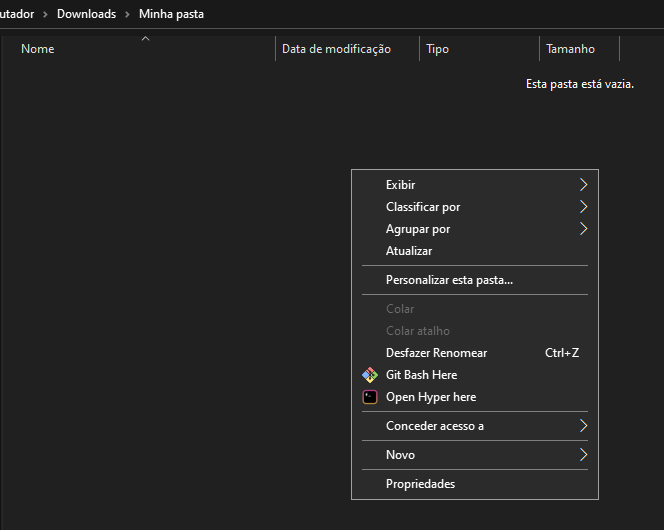
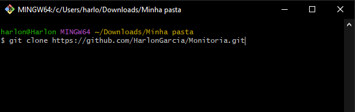

# Como baixar o código para meu computador?


## Para baixar o código, nós podemos _**clonar**_ o repositório


### 1. Primeiro instale o git: [O que é o git e como instalar](https://www.hostinger.com.br/tutoriais/tutorial-do-git-basics-introducao)

### 2. Com o git instalado, agora escolha ou crie uma pasta para clonarmos o repositório para dentro dela

### 3. Agora dentro da pasta, clique com o botão direito e abra o terminal


### 4. Com o terminal aberto, utilize o comando abaixo para clonar o repositório:
```
git clone https://github.com/HarlonGarcia/Monitoria.git
```


### 5. Pronto, agora você pode abrir o projeto na sua IDE normalmente:
* Clicando na pasta com o botão direito -> Abrir
* Ou abrindo sua IDE (Eclipse, IntelliJ, etc) -> Abrir projetos existentes -> Procurar a pasta onde se localiza o projeto